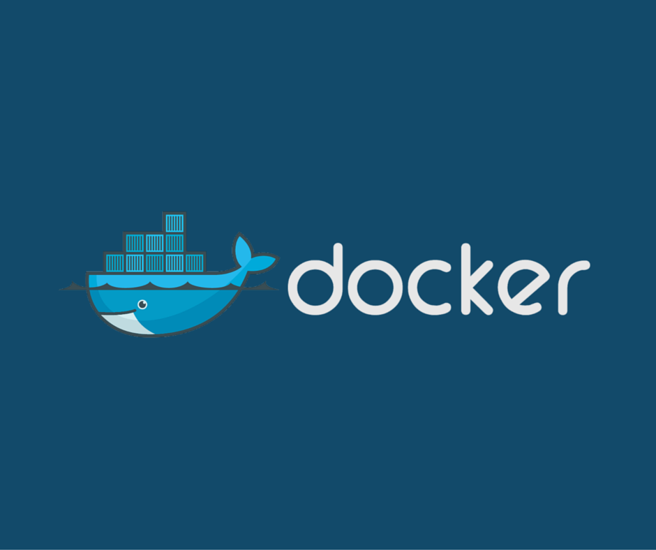
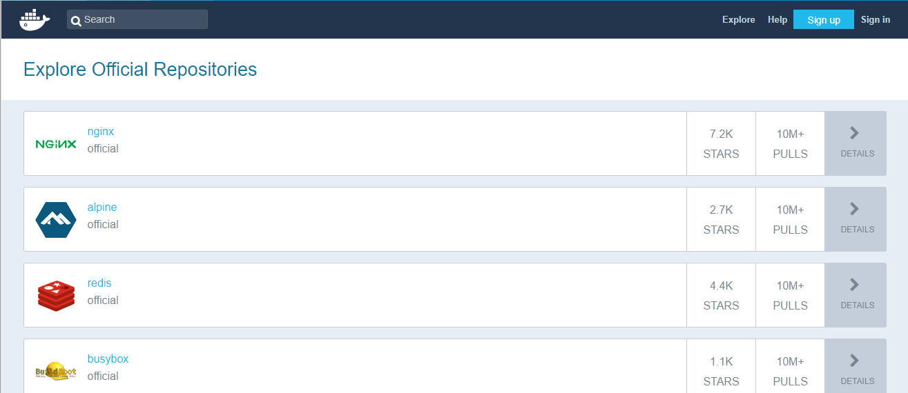

# 从零开始入门docker 第一课

------------------------

## 1. 为什么使用docker

先列举一下日常会碰到的几个场景

* 开发时为了配置某个环境反复安装。因为不同的机器硬件配置，软件环境各不相同
* 在开发机器上可以运行，在其他机器上出现各种问题
* 部署时又需要为了不同的环境反复调试

这些都是出现频率很高的问题，使用docker正是为了解决这些问题

### 1.1 docker是什么？

**docker是一种容器技术。**

现在的云服务器的基础是基于操作系统隔离的虚拟主机。在一台物理服务器上，虚拟出多个相互隔离的OS。因为是完整的操作系统，所以所需的空间一般是GB级，并且启动慢。下面引用来自官网的说明

>Virtual machines (VMs) are an abstraction of physical hardware turning one server into many servers. The hypervisor allows multiple VMs to run on a single machine. Each VM includes a full copy of an operating system, one or more apps, necessary binaries and libraries - taking up tens of GBs. VMs can also be slow to boot.

docker则是把隔离的类别从操作系统，直接操作虚拟主机（VM）；变成了应用程序级别的隔离，直接操作应用程序运行的容器（contains）。多个容器可以共享同一个操作系统内核。所需的空间是MB级，并且启动非常快一般是秒级。下面引用来自官网的说明

>Containers are an abstraction at the app layer that packages code and dependencies together. Multiple containers can run on the same machine and share the OS kernel with other containers, each running as isolated processes in user space. Containers take up less space than VMs (container images are typically tens of MBs in size), and start almost instantly.

### 1.2 docker的由来
docker是2013年PaaS提供商dotCloud开源的一个基于LXC（linux containers）的高级容器引擎，后期转为libcontainer。容器技术并不是docker首创，但是是在开源后广受欢迎并得到社区的大规模支持的。这些支持体现在我们可以在docker hub上找到官方维护的各主流应用的不同版本容器，而不需要自己再重新去创建对应的容器。

### 1.3 安装docker
docker支持在windows，linux，macos下使用。无论使用哪个系统均可以构建出一致的开发，部署环境。
* [win10 docker安装包地址](https://www.docker.com/docker-windows)
* [mac docker安装包地址](https://www.docker.com/docker-mac)
* [ubuntu docker安装地址](https://www.docker.com/docker-ubuntu)

