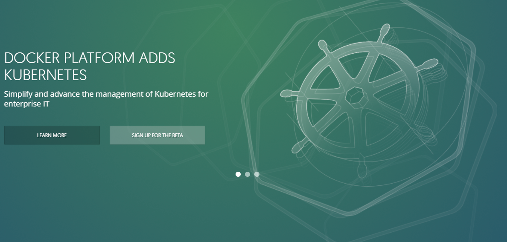

# 从零开始入门docker 第二课

------------------------------


## 2. docker的基本概念

docker有以下几个基本概念
- 容器(Container)
- 镜像(Image)
- 仓库(Repository)


### 2.1 docker镜像
操作系统分为内核和用户空间。对于linux就是内核启动后，挂载root提供用户空间支持。Docker镜像就相当于一个root文件系统。除了提供容器运行所需的程序，库，资源，配置等文件外，还包含一些为运行时准备的配置参数。但是镜像一旦构建完毕就不会再改变。

docker镜像并不是像操作系统安装包一样是一个完整的ios文件。是一层一层的文件包裹出来的文件系统。每一层构建完毕后，都将不会再改变，保证了每次运行的结果都是一致的。

通过如下命令，我们就拉取了一个nginx镜像至本地

``` bash
    $ docker pull nginx
```


### 2.2 docker容器
>容器的实质是进程，但与直接在宿主执行的进程不同，容器进程运行于属于自己的独立的命名空间。因此容器可以拥有自己的 root 文件系统、自己的网络配置、自己的进程空间，甚至自己的用户 ID 空间。容器内的进程是运行在一个隔离的环境里，使用起来，就好像是在一个独立于宿主的系统下操作一样。这种特性使得容器封装的应用比直接在宿主运行更加安全。也因为这种隔离的特性，很多人初学 Docker 时常常会把容器和虚拟机搞混。

>前面讲过镜像使用的是分层存储，容器也是如此。每一个容器运行时，是以镜像为基础层，在其上创建一个当前容器的存储层，我们可以称这个为容器运行时读写而准备的存储层为容器存储层。

>容器存储层的生存周期和容器一样，容器消亡时，容器存储层也随之消亡。因此，任何保存于容器存储层的信息都会随容器删除而丢失。

    官方文档使用的是python做示例，此处我使用java用于示例

#### 创建一个开发环境
在之前的方式下，我们要写一个java程序，首先我们需要在我们的机器上安装需要的java运行环境。这就导致了我们的程序要想在生产环境按预设的方式运行，就得和开发环境保持一致，比如开发环境是jdk8下开发的话，在生产环境如果是jdk7就可能出现问题。同时，开发环境下的某些环境设置，比如开发用户所在的用户组如果是管理员，但是生产环境的计算机上运行时不是以管理员运行的话，可能就会有一些权限的问题。
    
当然我们可以说尽量用同等的环境，但是当面对以下情况时。就不得不做出选择了。在服务器上已经运行了一个基于jdk8的程序，我们现在需要再部署一个基于jdk7开发的程序上去时，就不得不做出选择了。

通过docker，我们可以获取一个包含了java运行时的镜像，不需要安装依赖。然后我们可以以这个镜像作为基础，将我们的代码，依赖，运行时构建出一个新的镜像。

构建这个新镜像的文件称为Dockerfile,这是一个java程序镜像示例

``` bash
# 从官方仓库选择一个搭载了java8环境的镜像作为基础镜像
FROM anapsix/alpine-java:8

# 添加开发好的jar包至镜像并重命名
ADD XXX-API-1.0.0-SNAPSHOT.jar app.jar

# 配置数据库连接的环境变量
ENV DB_HOST localhost

# 配置redis连接的环境变量
ENV REDIS_HOST localhost

# 运行jar包
CMD ["java", "-jar","/app.jar","--spring.datasource.url=jdbc:mysql://${DB_HOST}:3306/yunsouth_api","--spring.redis.host=${REDIS_HOST}","--RSAKEY.publicKeyPath=/RSAKEY/public_key.der","--RSAKEY.privateKeyPath=/RSAKEY/private_key.der"]

```


### 2.3 docker仓库
镜像构建完毕后。我们可以在宿主机上运行了。但是我们如果想在其他机器上拉取并运行，则需要一个可以集中管理，分发docker镜像的服务。docker registry就是这样的服务

现在官方维护的docker registry服务是docker hub。我们可以从docker hub上拉取所需要的镜像。镜像的形式如下   <仓库名>：<标签> 。如果没有带标签则是默认latest。我们要拉取最新的mysql镜像至本地只需要运行如下命令

``` bash
$ docker pull mysql
```