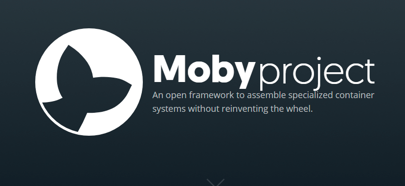

# 从零开始入门docker 第三课
------------------------------


## 3. docker Service
我们通过docker命令可以轻松的启动一个容器，但是如果我们拥有非常多的容器需要启动时（通常我们为了扩展的便捷，服务都细分较多。）。一遍遍的输入"docker run xxx"是非常费力并容易出错的。更不提我们需要在每个命令配置端口映射，配置数据卷等参数。因此一个启动多个容器的方式是需要的。

### 3.1 docker-compose介绍
docker-compose是通过一个yml文件，将应用程序的所需要的镜像，映射的端口，应该运行多少个副本，启动方式等进行编码。

通过docker-compose，我们可以容易的定义，运行，扩展服务。

### 3.2 docker-compose yml文件
这是一个docker-compose文件示例：
``` yml
# docker-compose 版本
version: "3"
# 需要编排的服务
services:
    # 服务的别名，可自定义
    web:
        # 此处镜像替换为自己创建的镜像
        image: username/repo:tag
        # 部署方式
        deploy:
            # 副本数0
            replicas: 5
            # 分配的系统资源
            resources: 
                limits:
                    cpus: "0.1"
                    memory: 50M
            # 重启方式
            restart_policy:
                condition: on-failure
        # 端口映射
        ports:
            - 80:80
```

编辑好docker-compose的yml文件后，只需要一行命令就能够启用对应的服务了

``` bash
# 文件夹
$ ls
docker-compose.yml

# 启动services
$ docker-compose up -d
```
